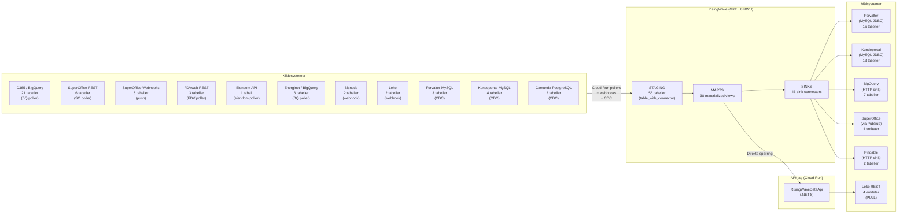
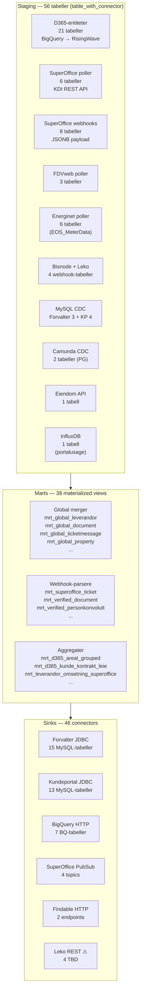
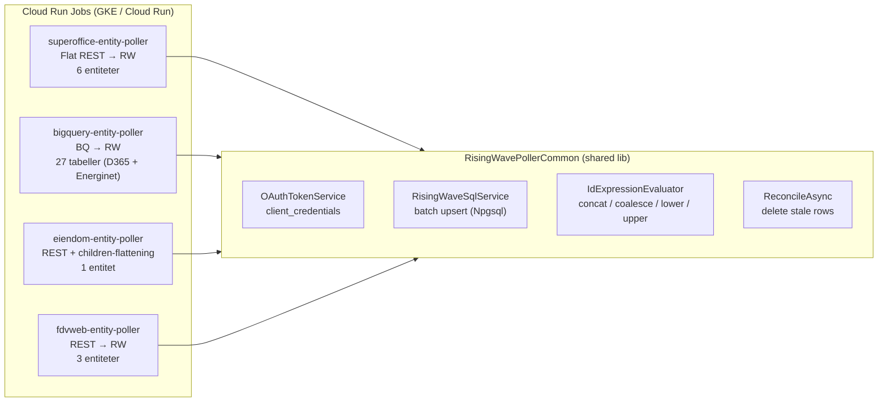
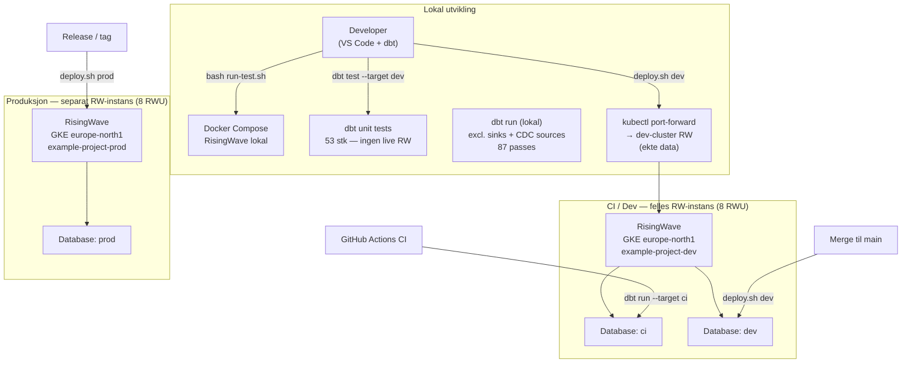
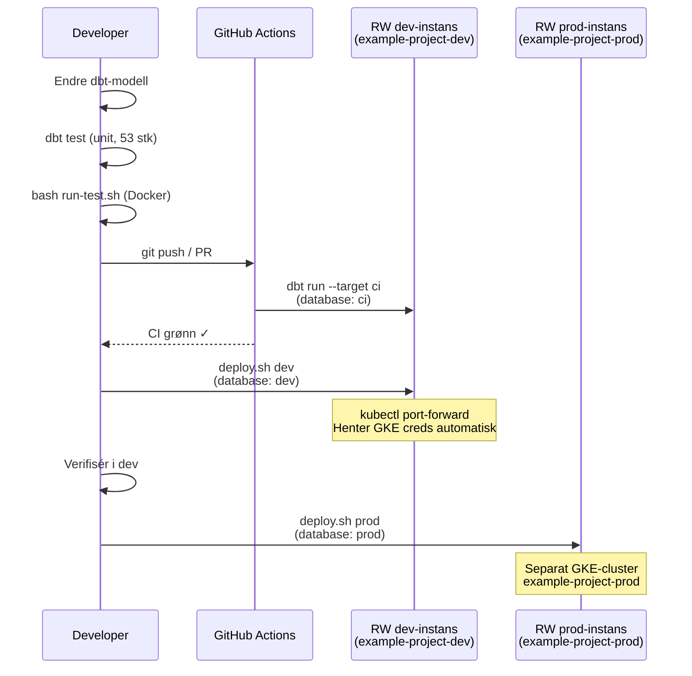
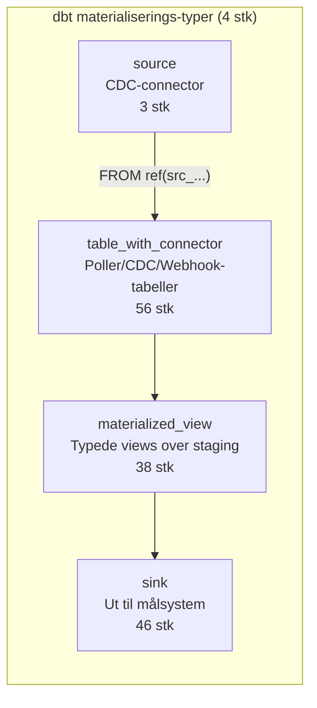
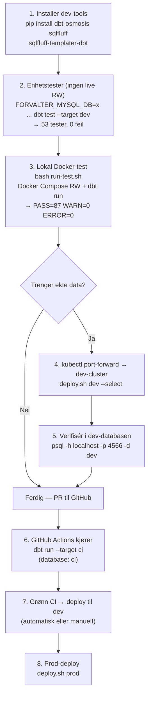

# KLP Eiendom — RisingWave Arkitektur

Teknisk presentasjon for RisingWave-ressurser · April 2026

---

## 1. Systemarkitektur — Oversikt

---

## 2. Data-lag i detalj

---

## 3. Cloud Run Pollers

---

## 4. Utviklingsmiljøer

---

## 5. Deployment-flyt

---

## 6. dbt DDL — Materialiserings-typer

---

## 7. Nøkkeltall

| Metrikk | Antall |
|---------|--------|
| Staging-tabeller | 56 |
| Marts (materialized views) | 38 |
| Sinks | 46 |
| CDC-sources | 3 (Forvalter MySQL, Kundeportal MySQL, Camunda PG) |
| Cloud Run pollers | 4 |
| dbt unit tests | 53 |
| Sink-level dbt tests | 39 |
| RisingWave-instanser | 2 (dev/CI delt · prod separat) |
| RWU per instans | 8 |
| Kildesystemer | 9 (D365, SO, FDVweb, Energinet, Eiendom, Bisnode, Leko, Forvalter, Kundeportal) |
| Målsystemer | 6 (Forvalter, Kundeportal, BigQuery, SuperOffice, Findable, Leko) |

---

## 8. Lokal utviklingsflyt — steg for steg

