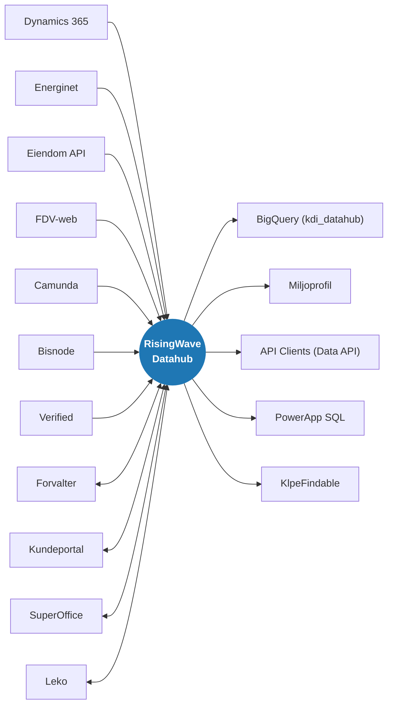
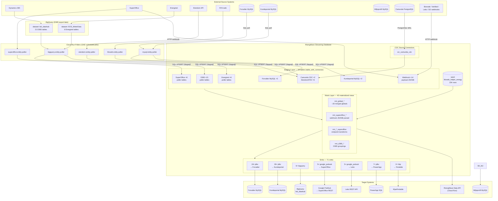

# Sesam to RisingWave Migration Showcase & Reference Architecture

A production-grade reference implementation and migration blueprint demonstrating how to migrate an integration hub from **Sesam** (microservices, DTL pipelines, and pipes) to **RisingWave** (PostgreSQL-compatible streaming SQL database) and **dbt**.

Originally developed for an enterprise property management integration platform, this repository provides concrete patterns for ingesting data from diverse systems (REST APIs, BigQuery, MySQL CDC, append-only webhooks), transforming and joining streams incrementally in real-time, and syncing results to downstream destinations.

> 🌟 **Start here**: [SHOWCASE_TOUR.md](SHOWCASE_TOUR.md) walks through the 5 core integration patterns (REST Poller, Webhook Dedup, CDC, Cross-System Mergers, and Parity Verification).
> 📖 **Deep-dive migration guide**: [SESAM_MIGRATION_GUIDE.md](SESAM_MIGRATION_GUIDE.md) covers concept mapping (DTL to SQL, Pipes to Sinks), deduplication patterns, and parity verification against Sesam datasets.

## System Integration Overview

This diagram provides a high-level "Datahub" view of all external systems connected to RisingWave, showing the direction of data flow (in, out, or bidirectional). This corresponds to the top-level overview previously found in Sesam.



### Integration Details

| System | Flow | Ingestion Method (In) | Export Method (Out) |
|--------|------|-----------------------|---------------------|
| **Forvalter** | ↔️ Bidirectional | MySQL Poller | JDBC Sinks |
| **Kundeportal** | ↔️ Bidirectional | MySQL Poller | JDBC Sinks |
| **SuperOffice** | ↔️ Bidirectional | REST Poller / Webhooks | Google PubSub Sinks |
| **Leko** | ↔️ Bidirectional | Webhooks | Google PubSub Sinks |
| **Dynamics 365** | ➡️ In Only | BigQuery Poller | - |
| **Energinet** | ➡️ In Only | BigQuery Poller | - |
| **Eiendom API** | ➡️ In Only | REST Poller | - |
| **FDV-web** | ➡️ In Only | REST Poller | - |
| **Camunda** | ➡️ In Only | PostgreSQL CDC | - |
| **Bisnode** | ➡️ In Only | Webhooks | - |
| **Verified** | ➡️ In Only | Webhooks | - |
| **Miljoprofil** | ⬅️ Out Only | - | JDBC Sinks |
| **BigQuery (datahub)**| ⬅️ Out Only | - | BigQuery Sinks |
| **PowerApp SQL** | ⬅️ Out Only | - | JDBC Sinks |
| **KlpeFindable** | ⬅️ Out Only | - | HTTP Sinks |
| **API Clients** | ⬅️ Out Only | - | RisingWave Data API |

## Architecture



## Repository Structure

```
KdiRisingWave/
├── dbt/                          # dbt project — all RisingWave DDL
│   ├── deploy.sh                 # Deploy to dev/test/prod via kubectl port-forward
│   ├── run-test.sh               # Local dev test (docker compose + dbt run)
│   ├── profiles.yml              # Connection profiles (dev/test/prod/ci/localdev)
│   ├── models/
│   │   ├── sources/              # CDC source connectors (src_*_cdc.sql)
│   │   ├── staging/              # Raw ingestion tables (56 tables)
│   │   ├── marts/                # Materialized views (38 views)
│   │   └── sinks/                # Output sinks (36 sinks)
│   └── seeds/
│       └── fdvweb_helper_energy.csv   # Energy grade lookup (234 rows)
├── src/cloud-run/
│   ├── RisingWavePollerCommon/        # Shared library (OAuth, upsert, IdExpression)
│   ├── superoffice-entity-poller/     # KDI REST API → RisingWave
│   ├── bigquery-entity-poller/        # BigQuery → RisingWave
│   ├── eiendom-entity-poller/         # Eiendom API → RisingWave
│   ├── fdvweb-entity-poller/          # FDV-web API → RisingWave
│   ├── mysql-entity-poller/           # MySQL → RisingWave (Forvalter + Kundeportal tables)
│   ├── risingwave-data-api/           # REST API exposing marts to downstream clients
│   ├── sink-error-collector/          # Collects and monitors sink errors
│   └── pubsub-writer/                 # PubSub webhook integration
├── kubernetes/                        # K8s manifests (dev/test/prod)
├── scripts/
│   ├── rw-connect.sh                  # kubectl port-forward helper
│   └── setup_env.sh                   # Generate .env file from K8s secrets
├── terraform/
└── docs/
    └── risingwave-issues.md           # Open RisingWave bugs/limitations
```

## Connecting to RisingWave

Since `ci`, `dev`, and `test` environments share the same RisingWave Cloud instance, and `prod` runs on its own dedicated instance, you can connect directly using credentials from your Vault/`.env` files:

```bash
psql -h <cloud_host> -p 4566 -d <env> -U <user>
```
*(The old port-forwarding scripts via `kubectl` are deprecated as all environments are now on RisingWave Cloud).*

## Deploying with dbt

### Smart Deployment

The `deploy.sh` script automatically implements a "smart deployment" logic for `dev`, `test`, and `prod` environments:
1. **State Sync**: It downloads the last known successful state (`manifest_<env>.json`) from a Google Cloud Storage (GCS) bucket.
2. **Change Detection**: It identifies which models have changed compared to the downloaded state using file hashes.
3. **Selective Execution**: It only runs the changed models and their downstream dependencies (`+`).
4. **Automatic Full-Refresh**: Changed models are executed with `--full-refresh` to ensure RisingWave tables/materialized views are updated correctly.
5. **State Update**: After a successful deployment, the new state is uploaded back to the GCS bucket.
### Environment Configuration & Variable Precedence

The `deploy.sh` script manages environment variables from multiple sources. To support controlled rollouts (e.g., gradually enabling sinks in production), the following precedence order is enforced (highest priority first):

1.  **System Environment Variables**: Variables set directly in the shell or via **Azure DevOps Pipeline Variables** (e.g., `FORVALTER_SINK_MODE=running`). These always "win" and can be used to override any other setting without changing code.
2.  **HashiCorp Vault**: The "Single Source of Truth" for environment-specific configuration and secrets. Values fetched from Vault override local `.env` files for common keys.
3.  **Local `.env` files**: (`.env.test`, `.env.production`). These provide safe default values for local development (e.g., `SINK_MODE=paused`) to prevent accidental external writes from a developer's machine.

**Operational Recommendation**: For gradual production setting, keep sinks `paused` in `.env.production` for safety, and override them to `running` via Azure DevOps variables as you go live with each system.

### Mixed OS Environments (Windows vs. Linux)

To ensure that `smart deploy` works consistently between local Windows machines and Linux-based CD agents (GitHub Actions / Azure DevOps), the project enforces **LF line endings**:
- **.gitattributes**: The repository has a `.gitattributes` file that forces `eol=lf` for all `.sql` and `.yml` files.
- **Normalization**: If you see unexpected "CHANGED" status for files you haven't touched, verify that your local files are using LF line endings. The `smart_deploy.py` script logs hash mismatches to `stderr` for debugging.

```bash
# To fix line ending mismatches locally:
git add --renormalize .
```

## How to Deploy

```bash
cd dbt

./deploy.sh              # all models → dev
./deploy.sh test         # all models → test
./deploy.sh prod         # all models → prod

# Selective deploy
./deploy.sh dev --select stg_superoffice_ticket
./deploy.sh dev --exclude tag:sink
```

Starts a local RisingWave + MySQL + PostgreSQL via docker compose and runs all models. 

Staging models that rely on CDC connectors or external databases use a **Mocking Strategy** (see below) to ensure they can be built without live connectivity to the source databases.

Expected: `PASS=87 WARN=0 ERROR=0 SKIP=0`

### CI and Local Development Strategies

To support local testing (`localdev`) and automated CI builds (`ci`) without causing side effects or requiring active connections to external databases, we apply conditional materialization strategies:

#### 1. CDC Mocking Strategy
Staging models using `table_with_connector` implement a mocking strategy:
- **Mock View**: If the target is `localdev` or `ci`, the model materializes as an empty `view` (`SELECT CAST(NULL AS type) AS column ... WHERE FALSE`).
- **Production Path**: For `dev`, `test`, and `prod`, it uses the real `table_with_connector` and live CDC sources.

#### 2. Sink View Strategy
Sinks are NOT created as actual RisingWave sinks during CI or local development to prevent sending test data to real external systems:
- **Mock View**: If the target is `localdev` or `ci`, sink models are materialized as standard `view`s instead of `sink`s.
- **Validation**: This allows unit tests (e.g., `dbt test`) to validate the final output by querying the views directly.

#### Implementation Pattern Example:
```sql

    {{ config(materialized='view') }}

    {{ config(materialized='table_with_connector') }} -- or 'sink'

```

This ensures the entire DAG can be compiled and validated in isolated environments.

### Unit Test Scenario Mapping (Sesam Parity)

In Sesam, unit tests are traditionally split across multiple files (`case-1.json`, `case-2.json`, `delete-case.json`, etc.) per endpoint. Because dbt operates on sets of rows using set-based operations (tables/views), we consolidated multiple Sesam scenarios into a single dbt test run for efficiency:

1. **Combined `given` Inputs**: All `scenario-X/` inputs for a specific endpoint from Sesam are placed into the `rows` array of a single `given` block as independent input rows.
2. **Combined `expect` Outputs**: All corresponding `expected/` outputs from Sesam are placed into the `rows` array of the `expect` block.
3. **Set-Based Assertion**: When `dbt test` runs, it mock-inserts all scenario rows simultaneously and asserts the final output matches exactly. This means a single dbt test like `snk_bygg_kundeportal__sesam_parity` actually executes the logic for multiple Sesam scenarios (standard mapping, missing fields, `_deleted` flags) in one pass.

## Maintaining RisingWave Tables

### How dbt handles existing objects

| Materialization | `dbt run` (normal) | `dbt run --full-refresh` |
|---|---|---|
| `table_with_connector` | **No-op** if table exists | `DROP TABLE CASCADE` + `CREATE TABLE` — **data lost** |
| `materialized_view` | `DROP + CREATE` | Same — always safe (data derived from staging) |
| `sink` | `DROP + CREATE` | Same — always safe (no stored data) |

Normal `dbt run` is safe for staging tables — it skips them if they already exist. Only `--full-refresh` or a manual `DROP TABLE` triggers recreation.

### Schema changes without data loss

**Poller tables — `ALTER TABLE ADD COLUMN` (preferred)**

Poller tables have no embedded connector, so RisingWave supports additive column changes:

```sql
ALTER TABLE stg_fdvweb_serviceavtale ADD COLUMN new_col VARCHAR;
```

Then update the dbt SQL to include the new column (for documentation and future full deployments). Existing data is preserved. Connect via `psql` through `deploy.sh`'s port-forward or the cloud endpoint.

**Webhook / CDC tables — must `--full-refresh`, data recovers automatically**

These tables have an embedded connector so `ALTER TABLE` is not supported. Drop and recreate with `--full-refresh`. Recovery:
- **Webhook tables**: Source systems replay events on next POST — data refills over time
- **CDC tables**: RisingWave replays the full binlog snapshot on reconnect — data refills automatically

**Mart / sink models — always safe to recreate**

These are derived objects (materialized views / sinks). They derive from staging tables, so drop + recreate is always fine.

### Decision guide

| Change type | Approach |
|---|---|
| Add column to poller staging | `ALTER TABLE ... ADD COLUMN` in psql, then update dbt SQL |
| Change column type in poller staging | Export data → `--full-refresh` → re-run poller |
| Any schema change to webhook or CDC staging | `--full-refresh` during low-traffic window |
| Change mart or sink logic | Normal `dbt run` (drops and recreates the view/sink) |

### Webhook secret rotation

All 12 webhook tables carry `tags=['webhook']`. To rotate `RW_WEBHOOK_SECRET`:

1. Update `RW_WEBHOOK_SECRET` in each `.env.*` file
2. Update `WebhookSecret` in Vault for every service that pushes webhooks (KdiWebHookWorker, KdiVerifiedApi, KdiLekoWorker, KdiRisikoVurdering)
3. Redeploy all webhook tables and their downstream marts:

```bash
./deploy.sh prod --select tag:webhook+ --full-refresh
```

## Sesam Seeding (seed_from_sesam.py)

Staging tables can be seeded from Sesam source datasets using the `seed_from_sesam.py` script. This is especially important for webhook-fed tables (such as `stg_superoffice_user`) that do not have active pollers, to prevent false delete propagations to downstream sinks that can cause foreign key violations.

For detailed instructions, architecture, commands, and troubleshooting, see the [Sesam Seeding Guide](docs/sesam_seeding.md).


## Source Systems

### Cloud Run Pollers

| Poller | Source | Auth | Tables |
|--------|--------|------|--------|
| `bigquery-entity-poller` | BigQuery (`kdi_datahub` + `EOS_MeterData`) | Service account | 21 D365 + 6 Energinet |
| `superoffice-entity-poller` | SuperOffice via KDI REST gateway | OAuth client_credentials | 6 |
| `eiendom-entity-poller` | Eiendom API | OAuth client_credentials | 1 (with child flattening) |
| `fdvweb-entity-poller` | FDV-web API | OAuth client_credentials | 4 |
| `mysql-entity-poller` | Forvalter + Kundeportal MySQL | MySQL user/password | 3 Forvalter + 2 Kundeportal |

All pollers use `RisingWavePollerCommon` — shared OAuth token cache, batch upsert via Npgsql, and `IdExpressionEvaluator` for composite key construction.

### Other Cloud Run Services

| Service | Purpose |
|---------|---------|
| `risingwave-data-api` | REST API (Swagger/OpenAPI) that exposes materialized views (marts) to downstream clients |
| `sink-error-collector` | Monitors and collects errors from RisingWave sinks |
| `pubsub-writer` | PubSub integration webhook writer |

### MySQL Poller

Both Forvalter and Kundeportal connect to a MySQL instance. The `mysql-entity-poller` Cloud Run service polls each table directly via SQL (`SELECT * FROM ...`) and upserts into RisingWave using the standard `RisingWavePollerCommon` batch upsert mechanism.

| Source | Database | Tables |
|--------|----------|--------|
| Forvalter | `forvalter-db-{env}` | BrukerRolle, ProsjektProsess, DokumentKontraktlinjeAvsjekk |
| Kundeportal | `kundeportal-db-{env}` | ByggTegning, Sakskategori (ticketcategory) |

`EnableReconciliation: true` ensures deleted rows are removed from RisingWave by comparing the full keyset on each poll cycle.

### PostgreSQL CDC

| Source | Database | Tables |
|--------|----------|--------|
| `src_camunda_cdc` | `process-engine` | camunda-processinstance, camunda-taskinstance |

### Webhooks (12 tables, `payload JSONB`)

| Table | Push source |
|-------|-------------|
| `superoffice-contactsimple` | SuperOffice |
| `superoffice-document` | SuperOffice |
| `superoffice-ticket` | SuperOffice |
| `superoffice-salesimple` | SuperOffice |
| `superoffice-projectsimple` | SuperOffice |
| `superoffice-ticketmessage-update` | SuperOffice |
| `superoffice-user` | SuperOffice |
| `bisnode-leverandor` | Bisnode |
| `bisnode-sanksjoner` | Bisnode |
| `verified-envelope` | Verified |
| `leko-kontrakt` | Leko |
| `lekoworker-directlink` | LekoWorker |

Webhook URL pattern: `POST http://<risingwave-host>:4560/webhook/dev/public/<table-name>`

### D365 via BigQuery — Full Table List

| RisingWave staging table | BigQuery source |
|--------------------------|-----------------|
| `stg_d365_ansatt` | Datavarehus.ansatt |
| `stg_d365_building` | Datavarehus.bygg |
| `stg_d365_bygg_avdeling` | Datavarehus.bygg_avdeling |
| `stg_d365_bygg_firma` | Datavarehus.bygg_firma |
| `stg_d365_kostkategori` | Datavarehus.dim_kategori |
| `stg_d365_leverandor` | Datavarehus.dim_leverandor |
| `stg_d365_faktura_detaljer` | Datavarehus.faktura_detaljer |
| `stg_d365_firma` | Datavarehus.firma |
| `stg_d365_garanti` | Datavarehus.garanti |
| `stg_d365_grunneiendom` | Datavarehus.grunneiendom |
| `stg_d365_kontrakt` | Datavarehus.kontrakt |
| `stg_d365_contract_line` | Datavarehus.kontrakt_linje |
| `stg_d365_kunde` | Datavarehus.kunde |
| `stg_d365_leieobjekt` | Datavarehus.leieobjekt |
| `stg_d365_prosjekt` | Datavarehus.prosjekt |
| `stg_d365_prosjektbilag` | Datavarehus.prosjektbilag_forvalter |
| `stg_d365_prosjektbudsjett` | Datavarehus.prosjektbudsjett_forvalter |
| `stg_d365_purring_detaljer` | Datavarehus.purring_detaljer |
| `stg_d365_areas` | Calculations.Areas_AsOf_Now |
| `stg_d365_leverandoromsetning` | Calculations.leverandoromsetning |
| `stg_influx_portalusage_sistaktiv` | portal_usage.ml_sist_aktivitet_pr_kunde |

### Energinet via BigQuery

| RisingWave staging table | BigQuery source (EOS_MeterData) |
|--------------------------|---------------------------------|
| `stg_energinet_adjustedenergyconsumption` | AdjustedEnergyConsumption |
| `stg_energinet_energyconsumption` | EnergyConsumption |
| `stg_energinet_energycustomerconsumption` | EnergyCustomerConsumption |
| `stg_energinet_maaltall` | Maaltall |
| `stg_energinet_wasteconsumption` | WasteConsumption |
| `stg_energinet_waterconsumption` | WaterConsumption |

## RisingWave Internal Layers

| Layer | Count | Materialization | Purpose |
|-------|-------|----------------|---------|
| Sources | 1 | `source` | CDC connector declarations (Camunda only) |
| Staging | 59 | `table_with_connector` | Raw ingestion — poller inserts, CDC tables, webhook JSONB |
| Seeds | 1 | table | `fdvweb_helper_energy` — energy grade thresholds |
| Marts | 40 | `materialized_view` | Multi-source merges, JSONB parsing, endpoint transforms |
| Sinks | 71 | sink | Push to target systems |

## Sinks

| Target | Connector | Count |
|--------|-----------|-------|
| Forvalter MySQL | `jdbc` | 19 |
| Kundeportal MySQL | `jdbc` | 26 |
| BigQuery | `bigquery` | 6 |
| Google PubSub (→ SuperOffice) | `google_pubsub` | 5 |
| Google PubSub (→ Leko) | `google_pubsub` | 5 |
| PowerApp SQL (MSSQL) | `jdbc` | 7 |
| KlpeFindable | `http` | 2 |

## Environments

| Environment | GCP Project | Infrastructure |
|-------------|-------------|----------------|
| `ci` | N/A (GitHub Actions) | RisingWave Cloud (Shared Instance) |
| `dev` | `example-project-dev` | RisingWave Cloud (Shared Instance) |
| `test` | `example-project-test` | RisingWave Cloud (Shared Instance) |
| `prod` | `example-project-prod` | RisingWave Cloud (Dedicated Instance) |

*Note: `ci`, `dev`, and `test` environments share the same RisingWave Cloud instance, while `prod` has its own dedicated instance.*

GCP projects are in `europe-north1`. Secrets are injected at runtime via HashiCorp Vault (`VaultOptions` in `appsettings.json`).

## Resources

- [RisingWave Documentation](https://docs.risingwave.com/)
- [dbt-risingwave adapter](https://github.com/risingwavelabs/dbt-risingwave)
- [RisingWave MySQL CDC](https://docs.risingwave.com/docs/current/ingest-from-mysql-cdc/)
- [RisingWave PostgreSQL CDC](https://docs.risingwave.com/docs/current/ingest-from-postgres-cdc/)
