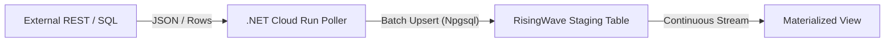

# Migrating from Sesam to RisingWave: An Architectural Blueprint

This guide documents the real-world migration of an enterprise integration hub from **Sesam** to **RisingWave** (a PostgreSQL-compatible streaming SQL database) orchestrated with **dbt**.

---

## 1. Why RisingWave?

Sesam is a powerful integration platform centered around dataset hops, DTL (Data Transformation Language), and microservice pipes. However, as dataset sizes and transaction volumes grow, several architectural benefits motivate moving toward streaming SQL:

| Feature | Sesam | RisingWave + dbt |
|---|---|---|
| **Paradigm** | Microservice pipes & DTL transforms | PostgreSQL-compatible Streaming SQL |
| **Data Flow** | Batch polling / scheduled hops | Real-time continuous stream processing |
| **Materialization** | Datasets stored on disk | Materialized Views with incremental state |
| **Language** | JSON-based DTL | Standard SQL (joins, windowing, aggregates) |
| **Ecosystem** | Sesam-specific tooling | PostgreSQL drivers, dbt, Grafana, Kafka, BI tools |
| **Testing** | Endpoint diffs | dbt unit tests, SQLFluff, automated parity diffs |

---

## 2. Conceptual Mapping

Migrating from Sesam to RisingWave is intuitive once you understand how key concepts translate:

```
┌─────────────────────────────────────────────────────────────┐
│                       SESAM CONCEPT                         │
├──────────────────────┬──────────────────────┬───────────────┤
│ Source Pipe          │ DTL Transform        │ Target Pipe   │
│ (System → Dataset)   │ (Hops & Dict Merges) │ (Dataset → DB)│
└──────────┬───────────┴──────────┬───────────┴───────┬───────┘
           │                      │                   │
           ▼                      ▼                   ▼
┌─────────────────────────────────────────────────────────────┐
│                    RISINGWAVE CONCEPT                       │
├──────────────────────┬──────────────────────┬───────────────┤
│ Table with Connector │ Materialized View    │ Sink          │
│ or CDC Source        │ (Incremental SQL)    │ (JDBC/PubSub) │
└──────────────────────┴──────────────────────┴───────────────┘
```

### Detailed Translation Matrix

| Sesam Concept | RisingWave / dbt Equivalent | Implementation in this Repo |
|---|---|---|
| **Source Pipe** | `table_with_connector` or `source` (CDC) | `dbt/models/staging/stg_*.sql` |
| **Dataset** | Staging Table or Materialized View | `dbt/models/staging/` & `marts/` |
| **DTL Hops (`hops`)** | SQL `JOIN` in Materialized View | `dbt/models/marts/mrt_global_*.sql` |
| **DTL Merges & Unions** | `UNION ALL` or `FULL OUTER JOIN` | `dbt/models/marts/mrt_global_leverandor.sql` |
| **Target Pipe (Sink)** | RisingWave `sink` | `dbt/models/sinks/snk_*.sql` |
| **Namespaces (`$ids`)** | Primary key expressions / columns | `IdExpressionEvaluator` & `PRIMARY KEY` |
| **Tombstones (`_deleted`)** | Dedup CTE + `_deleted` flag | `mrt_*_ticket.sql` dedup logic |

---

### Side-by-Side Code Comparison: DTL vs Streaming SQL

#### Example 1: Dataset Hop vs SQL JOIN
In Sesam, enriching an entity requires a DTL `hop`:
```json
// Sesam DTL:
["add", "vendor_name",
  ["first",
    ["hops", {
      "datasets": ["vendor v"],
      "where": [["eq", "_S.vendor_id", "v.id"]],
      "return": "v.name"
    }]
  ]
]
```
In RisingWave, this becomes standard, declarative SQL within a Materialized View:
```sql
-- RisingWave Materialized View (dbt):
{{ config(materialized='materialized_view') }}

SELECT
    c.contract_id,
    c.amount,
    v.name AS vendor_name
FROM {{ ref('stg_contract') }} c
LEFT JOIN {{ ref('stg_vendor') }} v 
    ON c.vendor_id = v.id
```
*RisingWave maintains this join continuously in memory with incremental compute. When either a contract or vendor updates, the join state updates instantly with microsecond latency.*

#### Example 2: Namespacing and Composite IDs
In Sesam, identifiers often include dataset prefixes (`$ids: ["contoso:customer:123"]`).
In RisingWave:
- Primary keys are explicitly typed (`VARCHAR PRIMARY KEY`).
- The .NET Poller library (`RisingWavePollerCommon`) evaluates expressions like `concat("org-", company_id, "-", user_id)` before upserting.
- Downstream joins use clean, standard relational keys.

---

## 3. Core Architectural Patterns

### Pattern 1: Polling Ingestion (REST & Databases)
Not all legacy systems support native CDC. For REST APIs (e.g. CRM, ERP) and relational databases without binlog access, lightweight worker services poll endpoints and upsert records to RisingWave:



- **Batch Upserts**: Uses `INSERT ... ON CONFLICT (id) DO UPDATE` to ensure idempotency.
- **Key Expressions**: Evaluates configurable key templates (e.g. `concat(dept_id, "-", user_id)`) to match Sesam composite IDs.
- **Reconciliation**: Sola/stale row cleanup via `ReconcileAsync` comparing current primary keys against the target table.

### Pattern 2: Append-Only Webhook Ingestion & Deduplication
Webhooks from SaaS providers (e.g. SuperOffice, DocuSign, Verified) are received via HTTP endpoints and inserted directly into RisingWave tables with a `payload JSONB` column:

```sql
-- Ingestion: Webhook connector creates append-only rows
CREATE TABLE stg_webhook_events (
    id VARCHAR,
    payload JSONB
) WITH (connector = 'webhook');
```

To reconstruct current state from the append-only stream, downstream Materialized Views use windowed deduplication:

```sql
WITH ranked_events AS (
    SELECT 
        payload->>'id' AS event_id,
        payload->>'status' AS status,
        payload->>'updated_at' AS updated_at,
        (payload->>'_deleted')::BOOLEAN AS is_deleted,
        ROW_NUMBER() OVER (
            PARTITION BY payload->>'id' 
            ORDER BY (payload->>'updated_at')::TIMESTAMPTZ DESC
        ) AS rn
    FROM {{ ref('stg_webhook_events') }}
)
SELECT *
FROM ranked_events
WHERE rn = 1 AND (is_deleted IS FALSE OR is_deleted IS NULL);
```

### Pattern 3: Zero-Overhead CDC (Change Data Capture)
For transactional databases (PostgreSQL, MySQL), RisingWave ingests the write-ahead log directly with sub-second latency:

```sql
CREATE SOURCE src_camunda_cdc WITH (
    connector = 'postgres-cdc',
    hostname = 'postgres-host',
    port = '5432',
    username = 'cdc_user',
    password = '...',
    database.name = 'process_engine',
    schema.name = 'public'
);
```

### Pattern 4: Downstream Sinks
RisingWave continuously pushes computed materialized view changes to downstream sinks without batch micro-batches:
- **JDBC / MySQL / Postgres Sinks**: Direct table synchronization with upsert semantics.
- **Google Cloud PubSub / Kafka**: Event streaming for microservices and API gateways.
- **BigQuery / Cloud Storage**: Streaming export for analytical data lakes.

---

## 4. Verification & Parity Testing (The Migration Safety Net)

One of the greatest fears during a platform migration is silent data corruption or field mismatch. This repository includes automated tools to prove 1:1 parity against your existing Sesam instance:

### 1. Seeding RisingWave from Sesam (`seed_from_sesam.py`)
Populates RisingWave staging tables directly with data extracted from Sesam source datasets. This enables validating the entire downstream SQL pipeline before switching live ingestion:
```bash
python dbt/scripts/seed_from_sesam.py --sesam-env test --rw-env test --select stg_user
```

### 2. Parity Value Verification (`verify_sink_values.py`)
Fetches records from the Sesam target pipe dataset and compares them row-by-row and field-by-field with the RisingWave sink:
```bash
python dbt/scripts/verify_sink_values.py --env test --sink snk_customer_bq
```
Output flags:
- Missing keys in RisingWave
- Extra keys in RisingWave
- Column-level value diffs (e.g. timestamp timezone formatting, null vs empty string)

### 3. Volume and Count Validation (`verify_sink_counts.py`)
Fast, high-level verification comparing overall row counts between Sesam and RisingWave sinks to ensure no data loss:
```bash
python dbt/scripts/verify_sink_counts.py --env test
```

---

## 5. Getting Started Locally

### Prerequisites
- Docker & Docker Compose
- Python 3.10+
- `pip install dbt-risingwave psycopg2-binary`

### 1. Start Local RisingWave
```bash
docker compose up -d
```
RisingWave PostgreSQL interface will be available at `localhost:4566`.

### 2. Configure Environment
```bash
cp .env.example .env.development
```

### 3. Run dbt Migrations
```bash
cd dbt
dbt seed --target dev
dbt run --target dev
dbt test --target dev
```
